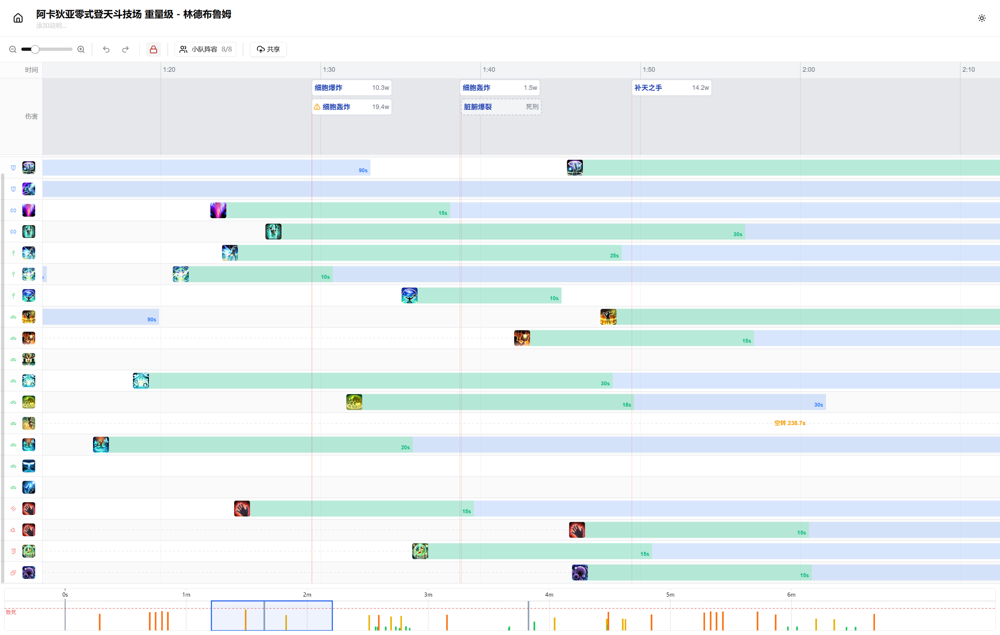
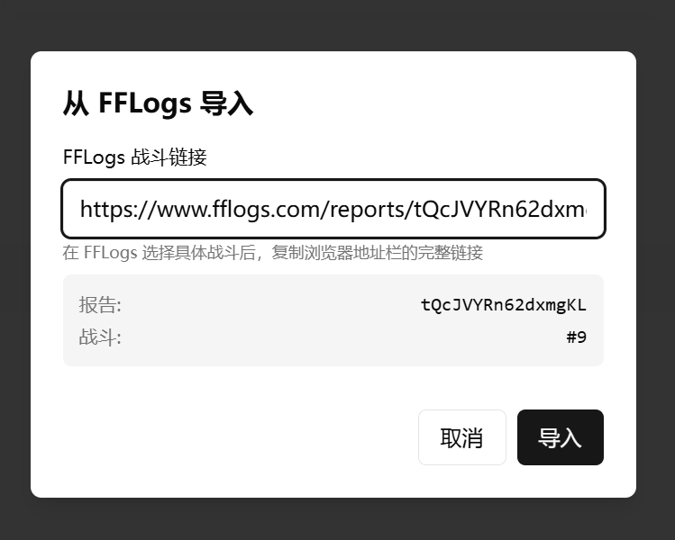
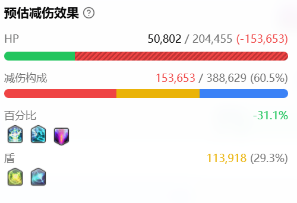

# 新手教程

## 1. Healerbook 能帮你做什么？

Healerbook 是一个 FF14 减伤规划工具。你可以把副本里每次全屏 AOE 和死刑都列在时间轴上，然后把全队的团建技能（雪仇、节制、牵制、昏乱……）安排到合适的时间点，工具会自动帮你算出每次伤害后全队还剩多少血，哪里会团灭，哪里很危险。



## 2. 快速开始：从 FFLogs 导入你的第一份时间轴

最快的上手方式是从一场已有的战斗记录开始。

### 第一步：准备 FFLogs 链接

去 FFLogs 找到你想规划的那场战斗，复制浏览器地址栏里的完整链接。链接大概长这样：

```
https://www.fflogs.com/reports/ABC123#fight=5
```

> 注意：链接里需要包含 `#fight=数字`，这样工具才知道你要导入哪场战斗。如果你只复制了报告链接而没有选择具体战斗，工具会提示你补充。

### 第二步：导入

1. 打开 Healerbook 首页
2. 点击 **「从 FFLogs 导入」**
3. 在弹出的对话框中粘贴链接（工具会尝试自动读取你的剪贴板）
4. 确认下方显示了正确的报告代码和战斗编号
5. 点击 **「导入」**



导入过程需要几秒钟，完成后会自动打开编辑器。

### 第三步：看看导入结果

导入完成后，你会进入编辑器页面，看到：

- **伤害事件轨道**上已经排好了这场战斗中所有的 AOE 和死刑
- **技能轨道**上显示了当时每个人实际使用的减伤技能
- 工具栏会显示 <BugPlay :size="16" color="#3b82f6" style="display:inline;vertical-align:middle" /> **「回放模式」** 标识——这表示当前数据来自实战记录

### 什么是回放模式？

从 FFLogs 导入的时间轴会默认处于 **回放模式**。在这个模式下：

- **时间轴是只读的**，你不能添加、删除或移动任何事件和技能
- 属性面板会显示**实战中每位玩家的实际受伤数据**，包括每个人的 HP 变化、实际吃到的伤害和生效的减伤状态
- 工具栏上会显示蓝色的 <BugPlay :size="16" color="#3b82f6" style="display:inline;vertical-align:middle" /> 图标表示当前处于回放模式

回放模式适合用来**复盘**：看看实战中哪些 AOE 大家扛得很勉强、哪些减伤漏了或时机不对。

当你想基于实战数据调整减伤方案时，可以退出回放模式切换到编辑模式。注意退出回放模式后，每位玩家的实际受伤明细会被清除（不可撤销），属性面板会改为显示模拟计算的预估效果。详见操作指南 [如何从回放模式切换到编辑模式](./howto/replay-mode)。

> 小贴士：如果你想保留原始回放数据作参考，可以先复制一份时间轴副本，只在副本上退出回放模式。

恭喜，你已经有了第一份时间轴！

## 3. 认识编辑器界面

编辑器分为几个主要区域：

- **工具栏**：顶部，包含缩放、撤销/重做、阵容、共享等按钮
- **时间标尺**：最上方，显示秒数刻度，帮你定位时间
- **伤害事件轨道**：标尺下方，蓝色方块是 AOE，橙色方块是死刑
- **技能轨道**：每个队员一行，显示该玩家使用的减伤技能图标
- **属性面板**：右侧栏，点击某个伤害事件后出现，显示详细信息和减伤效果
- **缩略时间轴**：底部，显示整条时间轴的缩略图，方便快速跳转

### 浏览时间轴

- **左右移动**：鼠标滚轮或拖拽，浏览不同时间段
- **缩放**：用工具栏的缩放滑块，或双指缩放（触控板），或 Ctrl + 滚轮
- **上下移动**：上下拖拽鼠标，或在左侧技能列使用滚轮上下滚动，或使用左侧滚动条，或 Shift + 滚轮，查看更多队员的技能轨道

## 4. 编排你的第一个减伤

> 如果你是从 FFLogs 导入的，需要先退出回放模式才能编辑（见操作指南「如何从回放模式切换到编辑模式」）。如果是新建的空白时间轴，可以直接开始。

### 添加伤害事件

如果你的时间轴上还没有伤害事件（比如新建的空白时间轴），先添加几个：

1. 在伤害事件轨道的空白处**双击**，或点击右键菜单的**添加**
2. 在弹出的对话框中填写：
   - **事件名称**：比如 "补天之手"
   - **时间**：这次伤害发生的时间，以秒为单位
   - **伤害值**：原始伤害数值（可以参考 FFLogs 或攻略）
   - **攻击类型**：AOE 或死刑
   - **伤害类型**：物理、魔法或特殊
3. 点击 **「添加」**

### 放置减伤技能

1. 在你想放技能的那个职业的技能轨道上**双击**
2. 你也可以**右键点击**技能轨道空白处，选择 **「添加」**

### 调整时间

放好之后觉得时机不太对？单击选中技能或伤害事件后直接使用鼠标**拖拽**，左右移动到合适的位置。


### 撤销误操作

操作失误不用慌：

- **Ctrl + Z**：撤销
- **Ctrl + Shift + Z**：重做

## 5. 看懂减伤效果

这是 Healerbook 最核心的功能。当你点击选中一个 **AOE 伤害事件**后，右侧的属性面板会显示减伤效果预估。

### HP 条

面板中间有一个 HP 条，直观显示这次 AOE 后全队的血量情况：



- **绿色部分**：剩余 HP
- **红色条纹部分**：受到的伤害
- 上方文字显示：`剩余HP / 最大HP (-受到伤害)`

### 警告提示

- <TriangleAlert :size="16" color="#ef4444" style="display:inline;vertical-align:middle" /> **「致死」**：这次伤害会秒杀非 T 职业玩家！会显示溢出了多少伤害
- <TriangleAlert :size="16" color="#f59e0b" style="display:inline;vertical-align:middle" /> **「危险」**：剩余 HP 不到 5%，非常危险，可能会被伤害浮动秒杀

### 减伤构成条

HP 条下方有一个彩色横条，展示伤害的构成：

| 颜色 | 含义                           |
| ---- | ------------------------------ |
| 黑色 | 溢出伤害（超出最大 HP 的部分） |
| 红色 | 有效伤害（实际掉的血）         |
| 黄色 | 被盾吸收的伤害                 |
| 蓝色 | 被百分比减伤抵消的伤害         |

鼠标悬浮在每个色块上可以看到具体数值。

<!-- 📸 截图：减伤构成条
     内容：属性面板中减伤构成条的特写截图，横条中蓝色/黄色/红色区段清晰可见，
     鼠标悬浮在蓝色区段上显示 tooltip（如"百分比减免: 45,000 (30%)"）。 -->

### 生效的减伤状态

最下方列出了在这次伤害时生效的所有减伤状态：

- **百分比减伤**：显示每个 Buff 的图标和减伤百分比，以及合计减伤率
- **盾值**：显示每个盾技能的图标和盾值大小

> 看到「致死」警告？试着在这个时间点附近多加一些减伤技能，比如一个牵制或昏乱，然后观察 HP 条的变化。

<!-- 🎬 动图：添加减伤后效果变化（核心演示）
     内容：选中一个显示「致死」的 AOE 事件 → 在附近的技能轨道上双击添加一个牵制 →
     属性面板 HP 条从全红变为红+绿，致死警告消失（或变为危险）→ 再添加一个昏乱 →
     HP 条绿色进一步增大。让读者直观看到"加减伤 = 血线变安全"的效果。
     这是整篇教程最关键的动图，时长 8-12 秒。 -->

## 6. 保存与分享

### 自动保存

好消息：你不需要手动保存。每次编辑后 2 秒，Healerbook 会自动把时间轴保存到你的浏览器本地存储中。关掉页面再打开，数据还在。

> 注意：本地保存仅存在你当前的浏览器中。换浏览器或清除浏览数据会丢失。如果想长期保存或分享给别人，请发布到云端。

### 发布到云端

1. 点击工具栏右侧的 **「共享」** 按钮
2. 如果还没登录，点击 **「登录 FFLogs」** 完成授权
3. 登录后点击 **「发布」**，确认后你的时间轴就上线了
   > 登录 FFLogs 不会获取你的任何私人数据，仅用来识别时间轴的作者身份。时间轴发布后，仅作者可以编辑，其他人只能查看。
4. 复制弹出的分享链接，发给你的队友

<!-- 📸 截图：共享弹出面板（已发布状态）
     内容：SharePopover 处于"已发布"状态，显示地球图标 + 状态文字、
     分享链接输入框、复制按钮。 -->

队友打开链接就能看到你的减伤规划，也可以点击 **「在本地创建副本」** 复制一份到自己的浏览器进行修改。

### 更新已发布的时间轴

编辑后，共享按钮上会出现一个橙色小圆点，提示有未发布的修改。点击 **「共享」→「发布更新」** 即可同步到云端。

## 7. 下一步

你已经掌握了 Healerbook 的基本用法！接下来可以按需查阅操作指南，了解更多功能：

- 想参考大佬的减伤方案？→ [如何参考 TOP100 方案](./howto/top100)
- 需要调整队伍职业？→ [如何管理小队阵容](./howto/manage-composition)
- 想给队友标注重点？→ [如何使用注释](./howto/annotations)
- 键盘快捷键不够熟？→ [键盘快捷键速查](./howto/keyboard-shortcuts)
